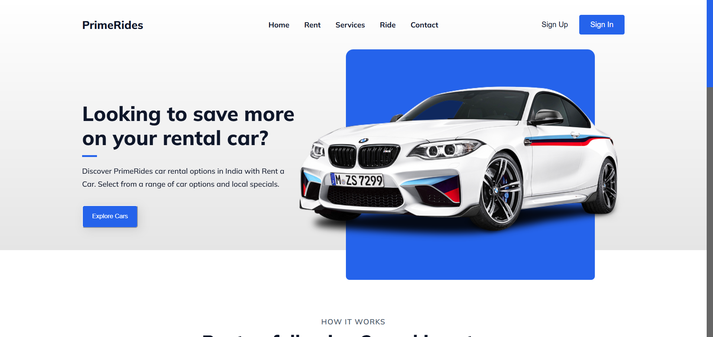
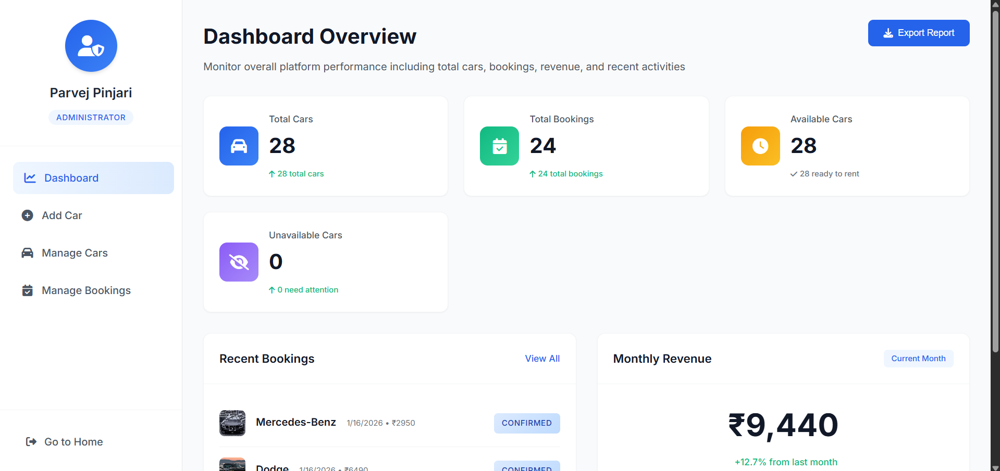
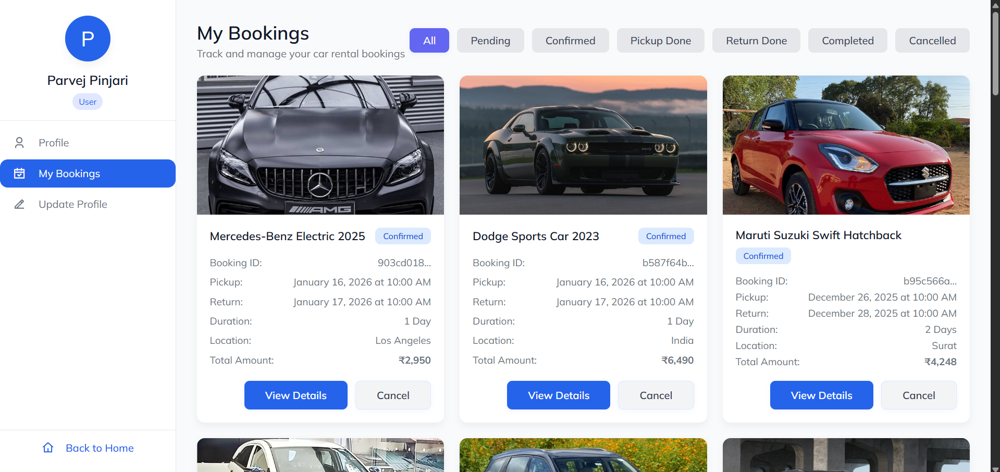

---

## 🧭 Home Section

## 🛠 Admin Dashboard

## 👤 User Panel

---
<h1 align="center">🚗 PrimeRides – Online Car Rental System</h1>

  A modern web-based car rental application to book premium rides easily & securely.

  <a href="https://primerides.vercel.app" target="_blank">🌍 Live Demo</a> •
  <a href="https://github.com/Parvej-Developers" target="_blank">💻 GitHub</a>

  
  
  
  
  

## 📌 Abstract

The system enables users to register, browse available vehicles, filter cars based on preferences, and book rentals for specific dates and durations. It features secure user authentication, real-time car availability, booking history, and automated rental cost calculation.

Authentication and database management are handled using **Supabase**, ensuring secure login, role-based access control, and reliable storage of user, vehicle, and booking data.

---

## 🎯 Project Overview

### 🔹 Introduction

The Car Rental Application is a web-based platform designed to simplify and digitalize the process of renting cars. Users can browse, check details, and book vehicles online without visiting a rental office.

### 🔹 Purpose of the System

* Replace manual rental processes
* Reduce errors and paperwork
* Ensure secure data handling
* Provide a faster and more reliable rental experience

---

## 👤 User Roles

### 🔑 Admin Role

The administrator manages the entire system by:

* Adding new cars
* Updating vehicle details
* Managing availability
* Viewing and controlling bookings

This centralized control ensures accuracy and prevents booking conflicts.

### 👥 User Role

Users can:

* Create an account
* Login securely
* Browse available cars
* View specifications & prices
* Book vehicles for selected time periods

The interface is designed to be **simple, clean, and responsive**.

---

## 💾 Data Management

The system securely manages:

* User details
* Car specifications
* Booking records

This ensures organized storage, accurate record-keeping, and easy retrieval of data.

---

## 📄 Pages & Sections

### 🏠 Home Page

* Attractive banner with premium car imagery
* Promotional message for rental savings
* Quick access to explore cars

---

### 🧭 Rent (How It Works)

Explains the 3-step rental process:

1. Choose location
2. Select pickup date & time
3. Browse & book a car

---

### 💼 Services Section

* Affordable deals
* Best price guarantees
* 24/7 customer support

---

### 🚘 Ride Section

* Competitive pricing
* Flexible payment options
* 24/7 roadside assistance

---

### 🧾 Footer

* Quick navigation links
* Social media icons
* Copyright information

---

## 🔐 Authentication Pages

### 📝 Sign Up Page

* Clean pop-up form
* Secure registration
* Easy switch to sign-in for existing users

### 🔑 Sign In Page

* Secure login pop-up
* Quick account access

---

## 🧑 User Panel

### 👤 User Profile

* Personal & contact details
* License information
* Account status

### 📖 My Bookings

* View upcoming, completed, and cancelled bookings
* Easy booking management

### ✏️ Update Profile

* Edit personal details
* Address & emergency contact updates

---

## 🛠️ Admin Panel (Dashboard)

### 📊 Admin Dashboard

* Total cars
* Total bookings
* Revenue overview
* Recent system activity

### ➕ Add Car

* Enter car name, type, price, seats, fuel type, image URL

### 🗂️ Manage Cars

* View, edit, delete vehicles
* Monitor availability & total bookings

### 📋 Manage Bookings

* Track all customer bookings
* View duration, amount, and status

---

## 🚗 Booking Flow

### 🟢 Available Cars

* Displays cars ready for rent
* Includes price, model, fuel type, seats, availability

### 📅 Booking Page

* Selected car details
* Pickup & return date selector
* Easy booking confirmation

### 💳 Your Booking & Payment

* Rental summary
* Duration & total charges
* Tax calculation
* Final confirmation
---

## 💳 Payment Integration

PrimeRides includes a secure online payment system powered by **Razorpay (Test Mode)**.

### 🔹 Features

* Secure online payment processing
* Razorpay test mode integration for safe transactions
* Automatic rental cost calculation before payment
* Payment confirmation after successful booking

### 🔹 How It Works

1. User selects a car and rental duration
2. System calculates total cost (including taxes)
3. User proceeds to payment
4. Razorpay payment gateway is opened
5. On successful payment, booking is confirmed and stored in the database

### 🔹 Test Payment Details

This project uses **Razorpay Test Mode**, so no real money is charged.

You can use Razorpay’s test credentials:

* Card Number: `4111 1111 1111 1111`
* Expiry Date: Any future date
* CVV: Any 3 digits
* OTP: `123456`

> ⚠️ Note: This is a demo payment system. No real transactions are processed.

---

## 📜 Policy Pages

* Return Policy
* Refund Policy
* Terms & Conditions
* Privacy Policy

These ensure transparency, fairness, and user trust.

---

## 🧰 Tech Stack

| Technology | Usage                   |
| ---------- | ---------------------   |
| HTML       | Structure               |
| CSS        | Styling & Layout        |
| JavaScript | Logic & Interactivity   |
| Vercel     | Deployment              |
| Supabase | Database & Authentication |

---

## 🌍 Live Project

🔗 **[https://primerides.vercel.app](https://primerides.vercel.app)**

---

## 👨‍💻 Author

**Parvej Pinjari**
📧 Email: **[parvejpinjari007@gmail.com](mailto:parvejpinjari007@gmail.com)**
💻 GitHub: [https://github.com/Parvej-Developers](https://github.com/Parvej-Developers)

---

## ⭐ Show Your Support

If you like this project, please ⭐ star the repository!

